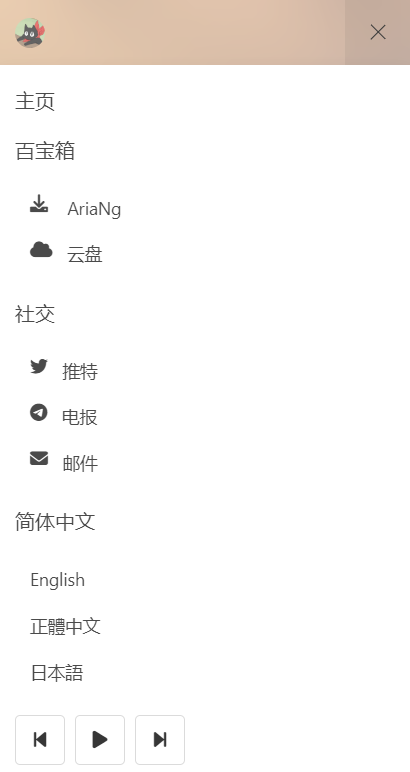

# ProfilesPage
 A simple and beautiful personal navigation page.
 [Preview](https://ojhdt.com/)

 ## Feature
 1. Parallax background effect based on mouse movement and gyroscope.
 2. Built-in music player!
 3. Auto switching background.
 4. Multiple language support.

 ## Screenshots

 Desktop
 

 

 Mobile Device
 
 
 

 ## Installation
 1. Place the entire project into the web container(Apache, Nginx, as you like).
 2. Modify the `/source/data.json` file, which includes links to background images and music resources.
 3. Modify the index.html file under each language folder as needed.

 ## Credits
 [bulma](https://github.com/jgthms/bulma)

 [aplayer](https://github.com/DIYgod/APlayer)

 [background-check](https://github.com/kennethcachia/background-check)

 ## License
[MIT](https://github.com/ojhdt/ProfilesPage/blob/main/LICENSE)